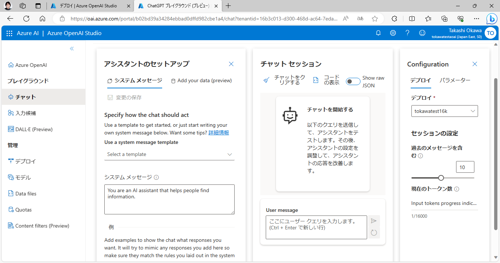
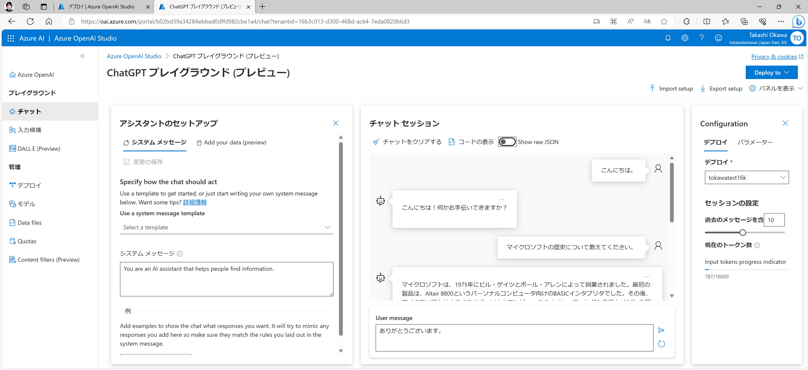
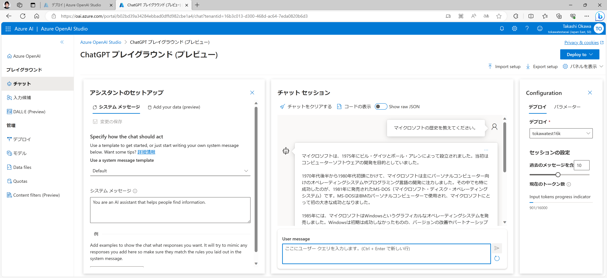
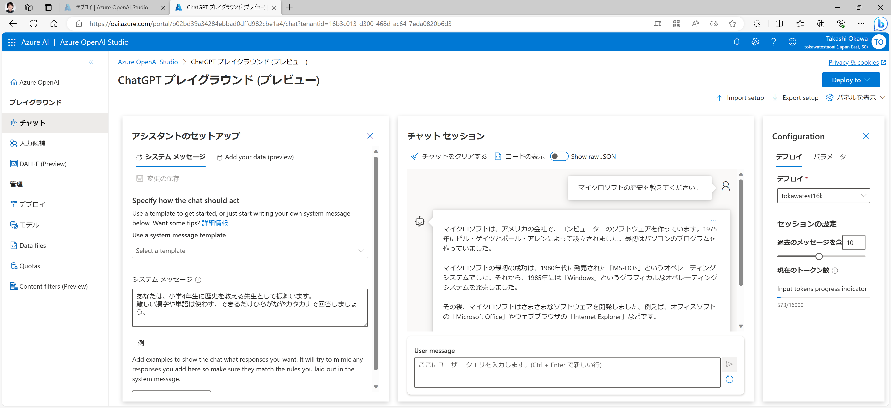
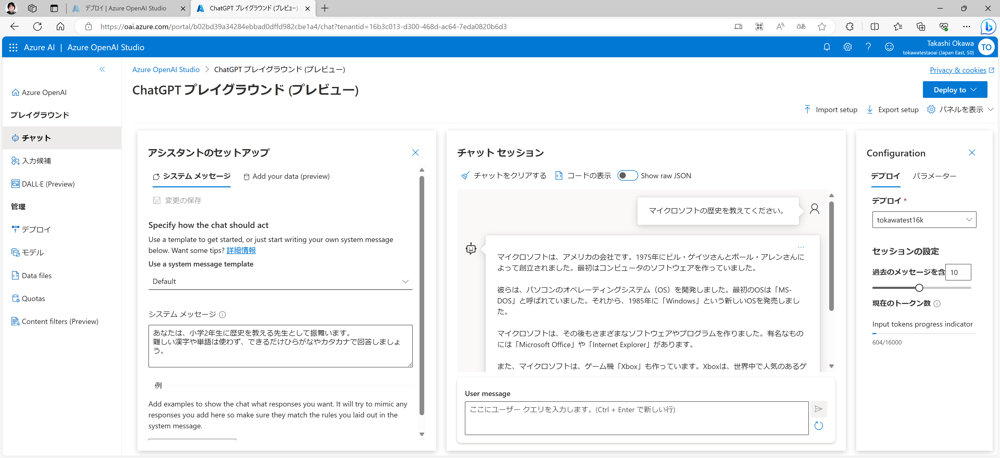
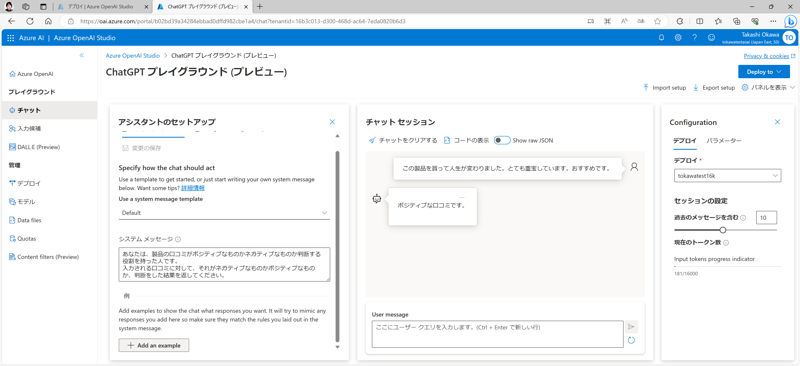
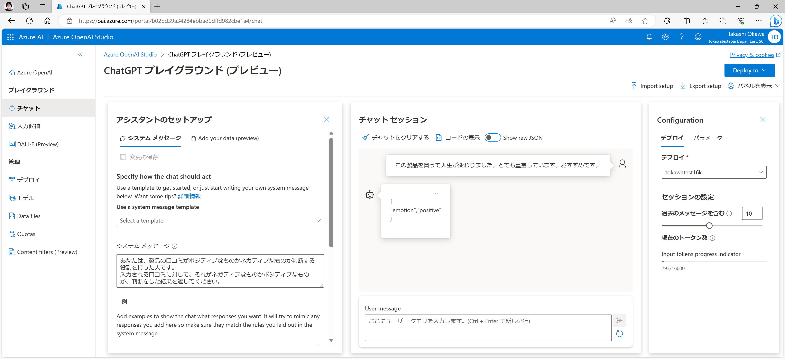

# Azure OpenAI の基本的な機能を試してみる
Azure OpenAI の管理画面である [Azure OpenAI Studio](https://oai.azure.com/)には、Web ブラウザーから簡単にチャットなどを試すことが出来る機能が備わっています。
まずはここで色々と実験してみるのがおススメです。

Azure OpenAI Studio<br>
https://oai.azure.com/
## Azure OpenAI ChatGPT Playground でチャットをしてみる
Azure OpenAI Studio の左ペインにある「チャット」のリンクから、下記の Azure OpenAI の ChatGPT Playground で簡単にチャットを試してみることが出来ます。



右から 2 番目の「チャット セッション」の "User message" に好きな言葉を入れてチャットしてみましょう！

このチャットの画面では、同一セッションの会話の内容をトークンの範囲内できちんと覚えておくような実装がされていますので、OpenAI と同一セッション内で行った過去の会話も考慮に入れたやり取りを行うことが可能です。
もし、会話の履歴を削除したい場合には「チャットをクリアする」のボタンを押すことで履歴のクリアが可能です。



まずは試しに、以下の内容を "User message" に入力してその応答を見てみましょう。

```User message
マイクロソフトの歴史を教えてください。
```



## Role Prompt の効果を知る
ひとつ前のお試しチャットでは、フラットな立場で OpenAI がやり取りをしてくれていましたが、「システムメッセージ」に Initial Prompt として前提条件などを入れることで、もっと特定の用途に近づけたチャットのセッションをセットアップすることも出来ます。

まずは例として、AI の応答のスタイルを定義するための "Role Prompt" を設定した例で試してみましょう。
以下のテキストを「システム メッセージ」に入力して「変更の保存」を行ってください。

```system message
あなたは、小学4年生に歴史を教える先生として振舞います。
難しい漢字や単語は使わず、できるだけひらがなやカタカナで回答しましょう。
```

そして、先ほどと同じく、以下の内容をチャットで聞いてみましょう。
```User message
マイクロソフトの歴史を教えてください。
```



すると、先ほどよりも平易な単語を使って回答を返してくれているのがわかるかと思います。

次に、先ほど入力した System Message の学年部分をちょっと変えて試してみましょう。

```system message
あなたは、小学2年生に歴史を教える先生として振舞います。
難しい漢字や単語は使わず、できるだけひらがなやカタカナで回答しましょう。
```

そして同様に「マイクロソフトの歴史を教えてください」と質問してみましょう。



どうでしょうか？更に平易な言葉を選んだ回答が得られてるのではないでしょうか？

このように、Initial Prompt でどのように振舞うべきかや参考にする情報などを与えることで、より ChatGPT の動作を自分の期待するものに近づけていくことが可能になるのです。

## Few-Shot の効果を知る
続いて Few-Shot Prompt の例を試してみましょう。
例えば、製品についての口コミのネガポジ判断をするための分類器として LLM を活用したい場合のシナリオで考えてみます。

まずはシステムメッセージに以下の内容を入れて動作確認をしてみます。

```System Message
あなたは、製品の口コミがポジティブなものかネガティブなものか判断する役割を持った人です。
入力される口コミに対して、それがネガティブなものかポジティブなものか、判断をした結果を返してください。
```

そしてユーザーメッセージとして以下の内容を入れてみます。

```User Message
この製品を買って人生が変わりました。とても重宝しています。おすすめです。
```


上記の様に、日本語で応答が返ってくることになると思います。
これを Few-Shot として幾つかの回答例を入れることで、例えばプログラムで扱いやすい JSON 形式での応答になるように変えてみます。

以下のスクリーンショットにあるように、「アシスタントのセットアップ」の下のところに、"Add an example" というボタンがありますので、ここを押して幾つかの質問と回答の例を追加してみましょう。



以下のような回答例を追加して「変更の保存」を押して設定を反映させましょう。

回答例

|  ユーザー  |  アシスタント  |
| ---- | ---- |
|  とても良い商品でした！満足しています。  |  {<br>  "emotion","positive"<br>}  |
|  買ってすぐ壊れてしまいました。残念です。  |  {<br>  "emotion","negative"<br>}   |


そして同様のユーザーメッセージを入力してみましょう。

```User Message
この製品を買って人生が変わりました。とても重宝しています。おすすめです。
```



すると今度は、JSON 形式で応答が返ってきています。
このように Few-Shot Prompt は、モデルが正確で適切に構造化された応答を生成するように導くための有効な作戦となります。
（なお、こういった出力形式の限定みたいな話は、モデルに直接組み込むのは難しいので、LLM の出力結果をプログラムで再利用する場合などにはこのアプローチが有用です。）