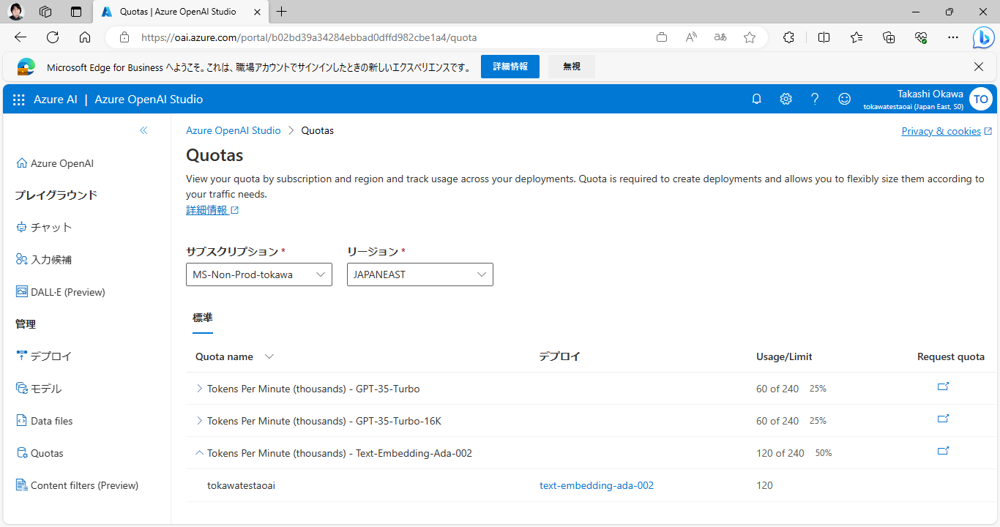
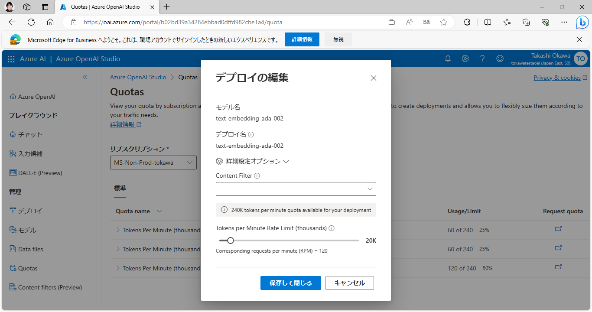
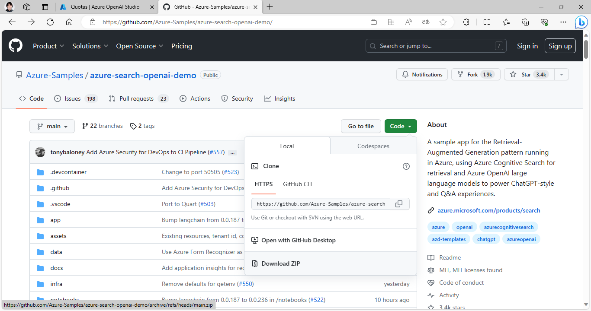
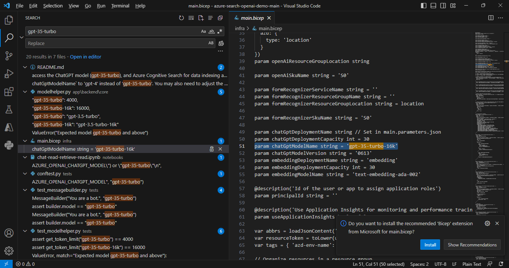
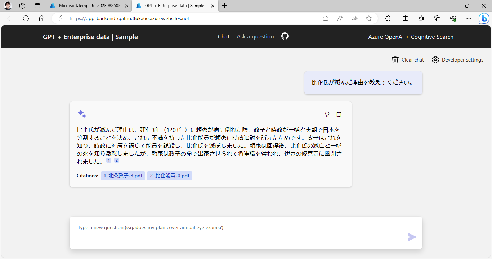

# Azure OpenAI に自前のドキュメントを組み込む
## 前提知識
### OpenAI にデータを足すためのアプローチについて
GPT の回答はあくまでも GPT が知り得る範囲の情報から尤もらしい答えを応答しているに過ぎないことは周知の事実かと思います。
従って、GPT に最新のデータや業務データ等の外部に公開されていないデータを考慮した回答をしてほしい場合には、何らかの方法で GPT にそれらの情報をコンテキストとして教える必要があります。

一方、GPT に教え込みたいデータが大量にあった場合には、GPT が一度に扱えるトークン数の上限がありますので、そのトークン数を超過しないようにコンテキストに含めるデータの量を加減しなければいけません。

この、大量のデータを教え込みたい、という要望と、GPT の扱えるトークン数の制約を両立するためのアプローチとして、以下のような方向性で進めることが可能です。

- 長い文章については、文章を短く区切り、GPT にコンテキストとして与えやすい形にする
- ユーザー入力をキーとしてデータベースを検索可能にし、教え込みたいデータのうち回答に必要と思われる部分だけを GPT のコンテキストに与えられるようにする

Microsoft では、このアプローチの概念検証コードとして、Azure Developer CLI にて簡単にデプロイできるようなものをご提供しています。

azure-search-openai-demo
https://github.com/Azure-Samples/azure-search-openai-demo/

今回は、この [azure-search-openai-demo](https://github.com/Azure-Samples/azure-search-openai-demo/) のサンプルを実際にデプロイして、ドキュメントが検索可能となることを試してみます。

## デプロイ手順
### Azure OpenAI の事前準備
この後に利用するサンプルコードにて、自動的に Azure OpenAI のモデルのデプロイメントが行われます。
その時に、TPM (アカウント毎に設定されている Token 上限) を超過しているとエラーになってしまうので、OpenAI Studio から既存のデプロイメントの TPM 割り当て数を 20-30 程度まで減らしておきます。

[Azure OpenAI Studio](https://oai.azure.com/) にアクセスして、Quotas の画面を開き、Usage/Limit の状況が充分にあいていることを確認しましょう。


もし割り当てが不足しそうでしたら、足りなくなりそうなモデルのクォータを展開すると、どのデプロイメントが TPM を割り当てられているのか確認できます。
またそこでモデル名をクリックすることで、モデルに割り当てる TPM を変更することも可能です。



東日本リージョンの全てのモデルのクォータの空き容量が充分であることを確認出来たら、次のステップに進みます。

### ソースコードのダウンロード
今回サンプルとしてデプロイするプロジェクトのソースコードを、GitHub からダウンロードします。

[azure-search-openai-demo](https://github.com/Azure-Samples/azure-search-openai-demo/) のリポジトリをブラウザーで開き、以下のスクリーンショットの様に、"Code" のメニューを展開した後、"Download ZIP" でソースコードをダウンロードします。



ダウンロードしたファイルは分かりやすいフォルダに展開してください。

### データの準備
今回使うサンプルでは、ソースコードが入っているディレクトリにある、"data" ディレクトリに入っている PDF ファイルを自動的に Embedding に変換して検索可能にしてくれるようになっています。
しかし、入っているデータは英語のため、ちょっと面白みに欠けるかもしれません。そこで、弊社同僚が作った、戦国武将の日本語データに差し替えてみます。

まずは、データが入っているリポジトリから Zip ファイルで一式のデータをダウンロードします。

busho-index<br>
https://github.com/tokawa-ms/busho-index

データのダウンロードが終わったら、busho-index の Zip ファイルも任意のディレクトリに展開します。
次に、前のステップでダウンロードして展開した azure-search-openai-demo のディレクトリ内の data ディレクトリにあるデータを一旦すべて削除します。
それから busho-index リポジトリから取ってきた pdf ディレクトリ内の PDF ファイルを、全て azure-search-openai-demo 内の data ディレクトリにコピーします。

これで azure-search-openai-demo/data/ ディレクトリには、日本語で書かれた戦国武将の PDF ファイル一式が置かれていることになります。

### 自動デプロイされる OpenAI のモデルの変更
このサンプルスクリプトでは、デフォルトで gpt-35-turbo を利用するようになっています。
しかし、gpt-35-turbo では日本語の大規模な PDF ドキュメントを引用するには不十分で、トークン数不足のエラーが発生する場合があるので、自動デプロイが行われる Azure OpenAI のモデルを "gpt-35-turbo-16k" に変更してしまいましょう。

変更するコードは、サンプルコードを展開したディレクトリの下にある、"infra" ディレクトリにありますので、そのディレクトリを開きましょう。
ディレクトリ内にある "main.bicep" ファイルを開き、51 行目あたりにある "param chatGptModelName" から始まる行を探してください。

現状では、`param chatGptModelName string = 'gpt-35-turbo'` と入力されていると思いますが、ここを `param chatGptModelName string = 'gpt-35-turbo-16k'` と変更します。

変更したら、ファイルを保存して変更を確定してください。



#### 補足 : Bicep とはなにか？
Bicep は、宣言型の構文を使用して Azure リソースをデプロイするドメイン固有言語 (DSL) です。 Bicep ファイル内で、Azure にデプロイするインフラストラクチャを定義し、そのファイルを開発ライフサイクル全体にわたって使用して、インフラストラクチャを繰り返しデプロイします。 リソースは一貫した方法でデプロイされます。

従って、似たような構成を大量に生産する場合や、同じ環境を繰り返しデプロイしなければいけない場合などに、ポータルからデプロイするのではなく、Bicep 言語で書いたコードから自動的にインフラのデプロイを実行することが可能になります。

普段の業務の省力化に非常に有用と思いますので、是非 Bicep 言語についても興味を持っていただければ幸いです。

Bicep とは<br>
https://learn.microsoft.com/ja-jp/azure/azure-resource-manager/bicep/overview?tabs=bicep

Bicep の基礎(Microsoft Learn の自習コンテンツ)<br>
https://learn.microsoft.com/ja-jp/training/paths/fundamentals-bicep/

### PowerSHell スクリプトの実行権限の調整 (PowerShell で実行する方限定)
サンプルコードのデプロイ中に使われる PowerShell スクリプトの中に、署名されていないものが紛れ込んでしまっているために、以下のコマンドでセキュリティポリシーの強度を一旦下げる必要があります。

```pwsh
> Set-ExecutionPolicy -Scope CurrentUser unrestricted
```

### サンプルコードの Azure へのデプロイ
サンプルコードを Azure にデプロイする為に、Azure Developer CLI を実行します。

```bat
azd up
```

まずは `Enter a new environment name:` という質問が表示されますので、任意の一意な名前を付けて <kbd>Enter</kbd> キーを押してください。

次に、`Select an Azure Subscription to use:` というメッセージが表示されますので、キーボードの上下キーでデプロイ先にしたい Subscription を選んで <kbd>Enter</kbd> キーを押します。

次に、`Select an Azure location to use:` というメッセージが表示されますので、リージョンを選びます。"Japan East" がおススメです。

すると、ソースコードのビルドやパッケージングが行われますので、しばらくお待ちください。

次に、`Enter a value for the 'openAiResourceGroupLocation' infrastructure parameter:` というメッセージが表示されますので、OpenAI のデプロイ先のリージョンを選択します。これも "Japan East" がおススメです。

次に、`Save the value in the environment for future use (y/N)` という質問が出ますが、これはどちらを選んでいただいても構いません。（著者は y で進めました）

ここまで来たら、あとはエラーが出ないことを祈ってデプロイ完了を待つばかりです。
こんな感じでデプロイが進んでいきます。


> 暫く時間がかかりますので、この間にコーヒーブレイクなど入れると良いでしょう。また、OpenAI Playground でプロンプトエンジニアリングの練習をしても良いと思います。

なお、環境デプロイが完了した後、データの登録のためのスクリプトが走り出します。
その際、スクリプトの実行許可を求める以下のようなプロンプトが出ますので <kbd>R</kbd> キーを押して処理を継続します。

```
Run only scripts that you trust. While scripts from the internet can be useful, this script can potentially harm your computer. If you trust this
script, use the Unblock-File cmdlet to allow the script to run without this warning message. Do you want to run
C:\azure-search-openai-demo-main\scripts\prepdocs.ps1?
[D] Do not run  [R] Run once  [S] Suspend  [?] Help (default is "D"):
```

このデータ登録が完了したら、Azure 上にあるデータベースに、入力した全ての PDF のデータが入っており、Web UI から検索可能な状態になります。

スクリプトの最後に、以下のようなメッセージで UI へのアクセス用の URL が表示されますので、こちらをメモしておきましょう。

```
Deploying services (azd deploy)

  (✓) Done: Deploying service backend
  - Endpoint: https://<your-appservice-name>.azurewebsites.net/
```

### Web UI から動作確認をしてみる。
Web UI にアクセスすると、Chat の画面が出てきますので動作確認をしてみましょう。

今回は鎌倉幕府に関連する武将の情報をグラウンディングのデータとして入れてありますので、その関連情報が出てくるように聞いてみます。



例えばチャットに、「比企氏が滅んだ理由を教えてください」と入れたときの内容がこんな感じです。
きちんと、"Citations" として、事前に入力した PDF の情報を引用してきたうえで、回答をまとめてくれていることがわかります。

